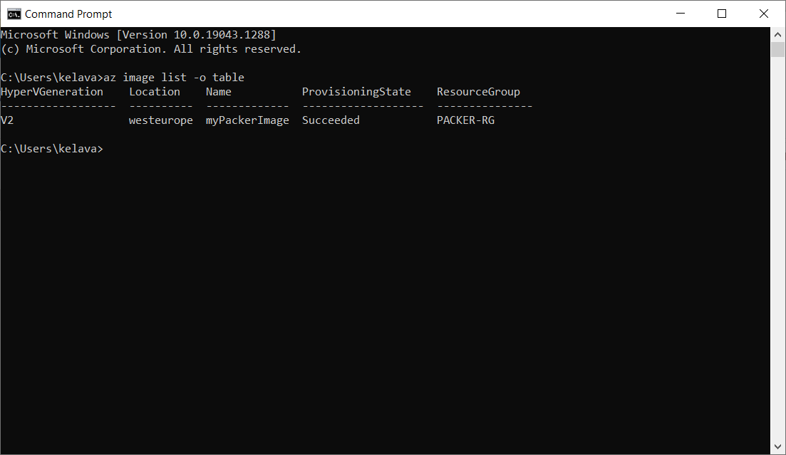
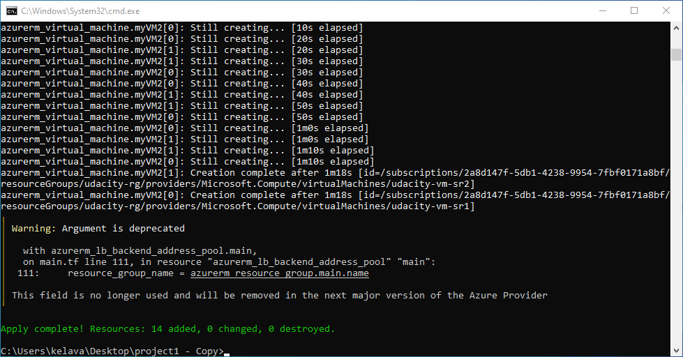
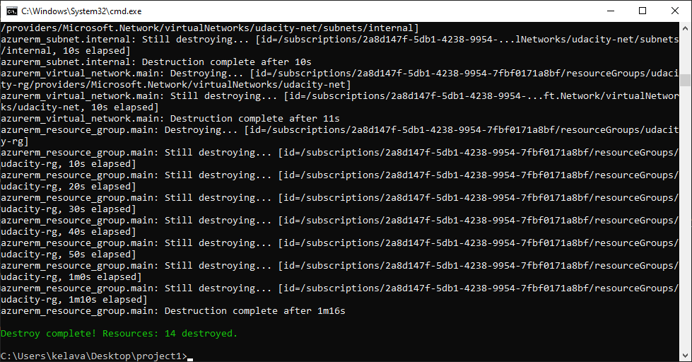
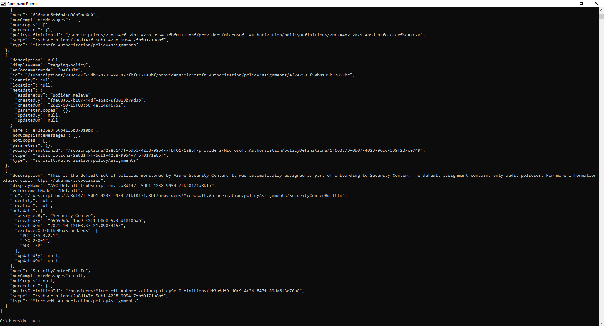
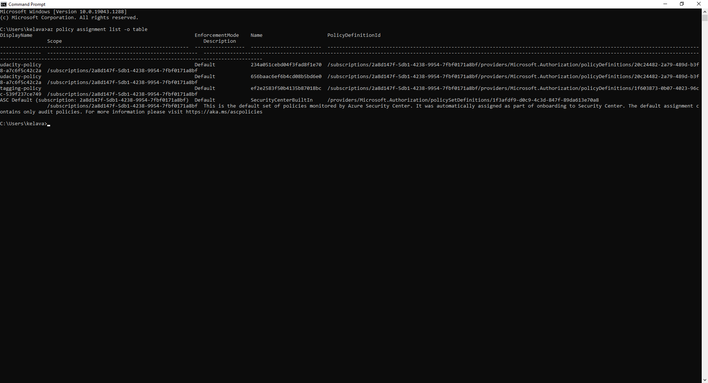
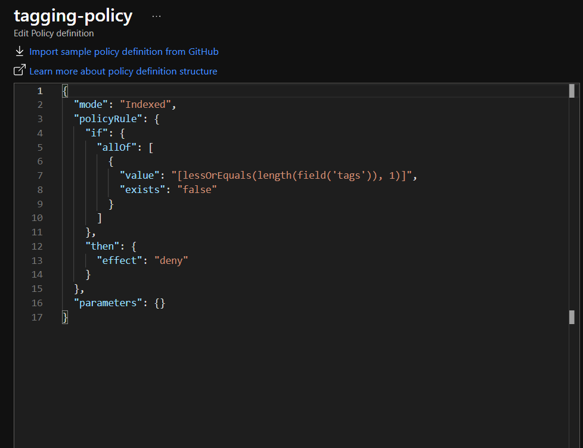
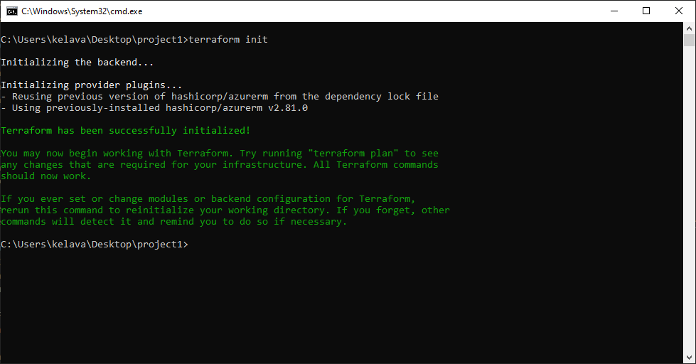

# Azure Infrastructure Operations Project: Deploying a scalable IaaS web server in Azure

### Introduction
The infrastructure as code gives us a huge advantage in defining, deploying, updating and destroying our infrastructure. So to set up an image which contains our application for repeatable deployments, we will use packer to create the virtual machine images(in JSON format).

Terraform also expands on this by not only deploying virtual machines but also storage, networking and security entities across multiple infrastructures, clouds and vendors.

Based on these, this project will use a Packer template and a Terraform template to deploy a customizable, scalable web server in Azure.

### Getting Started
1. Clone this repository
2. Create your infrastructure as code
3. Create your own policy in Azure
4. Deploy your server to Azure using Packer & Terraform

### Dependencies
1. Create an [Azure Account](https://portal.azure.com) 
2. Install the [Azure command line interface](https://docs.microsoft.com/en-us/cli/azure/install-azure-cli?view=azure-cli-latest)
3. Install [Packer](https://www.packer.io/downloads)
4. Install [Terraform](https://www.terraform.io/downloads.html)

### Instructions
Upon collecting all dependencies correctly, to deploy web server to Azure you need to:
1. Firstly, make sure you ran command below, command is used to log in into your azure portal
```bash
az login
```
2. Deploy the packer image, if you need any help, I suggest you use provided documentation: https://www.packer.io/docs
3. Deploy the infrastructure with Terraform template, f you need any help, I suggest you use provided documentation: https://www.terraform.io/docs/index.html

### Output
1.  If you successfully deployed VM image using Packer, you can use the command below to list all the aviable VM images
```bash
az image list -o table
```

2. If you successfully deployed infrastructure, you should get message show below:



3. Check resources using command below:
```bash
terraform show
```
4. After deployment, destroy resources using command:
```bash
terraform destroy
```

### Additional Screenshots
Policies in Azure - list and table view



Tagging policy definition


Running command below and result of the same
```bash
terraform init
```


List of Azure VM


